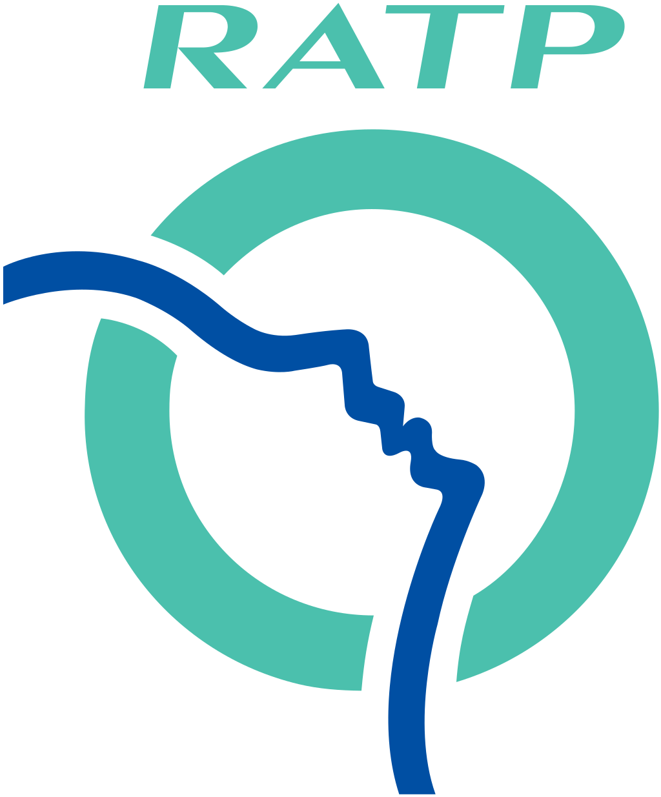

# Metro-Chatbot

ESILV A4 (2019-2020) : Chatbot and Recommendations System

Done by Baptiste Goasduff

Run the app : 
```node server.js```

---

### Le projet

Création d'un Chatbot connecté à Facebook Messenger.

Chatbot permettant d'obtenir des informations sur le métro parisien.

---

### Node JS

create NodeJs project : 
```npm init```

install packages : 
```npm install body-parser, axios, express, crypto```

---


### Utilisation d'une API

Api utilisée : https://github.com/pgrimaud/horaires-ratp-api



---

### Connection avec facebook

Webhook 

Facebook Page : TestBot (https://www.facebook.com/TestBot-100527764823266/?modal=admin_todo_tour)

ngrok command : 
```ngrok http 3000```

Change information on facebook developper Webhook and messenger 

---

### NLP (Natural Language Processing)

Utilisation de https://wit.ai/ pour trouver les entities (intent ... ) par rapport à ce que l'utilisateur écrit.

---

